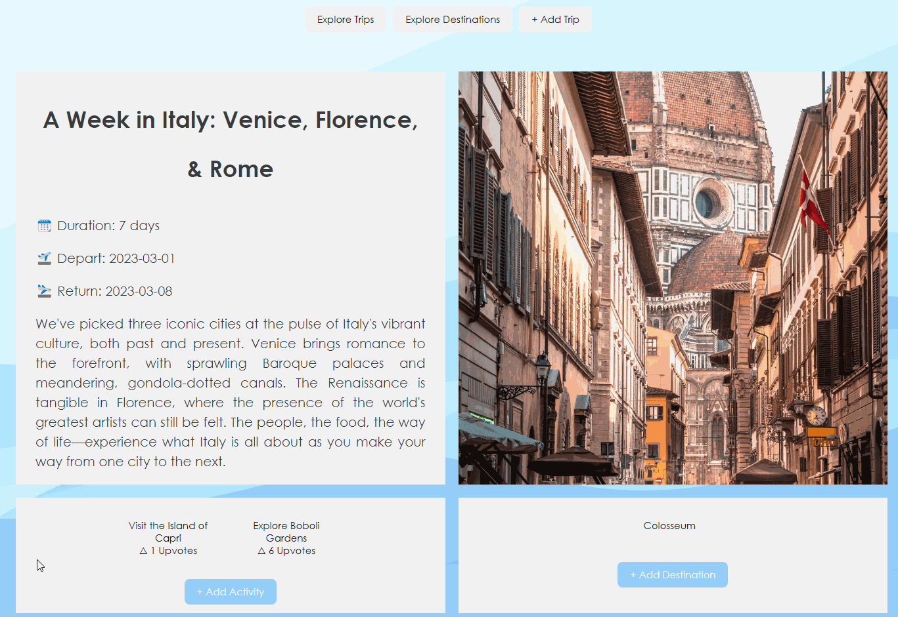

# On the Fly

#### Developed a full stack website that allows users to plan trips, activities and add destinations. Users can login via GitHub OAuth and add other users to trips.
Technologies used: PostgreSQL, React.js, Express.js, Node.js, Passport.js, Railway, Postman 

#### Login 

#### View a trip

#### Add a trip

#### Delete / Update a trip

